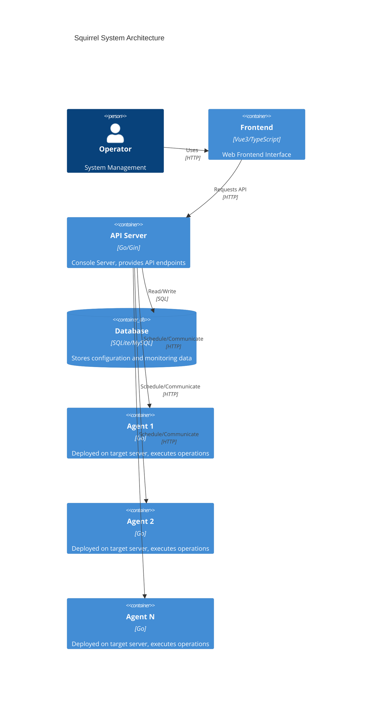

# Squirrel Dev

A lightweight, modern operations management platform that supports server management, application deployment, monitoring & alerting, and script execution.

[](LICENSE)
[](https://golang.org)
[](https://vuejs.org)

**[中文文档](docs/zh-CN/README.md)**

## Features

- **Server Management** - Unified management of multiple servers with Web terminal support
- **Application Deployment** - One-click deployment, start, and stop for Docker Compose applications
- **App Store** - Built-in common application templates for quick service deployment
- **Monitoring & Alerting** - Real-time collection of CPU, memory, disk, and network resource usage
- **Script Management** - Scheduled task management with Cron expression support
- **Configuration Center** - Centralized application configuration management with dynamic updates
- **CLI Tool** - squctl CLI tool for convenient operations

## System Architecture

Squirrel adopts an agent-based architecture, supporting one API Server managing multiple Agents on different servers:



### Screenshots


### Core Components

| Component | Description | Default Port |
|-----------|-------------|--------------|
| `squ-apiserver` | Console server providing API endpoints and frontend interface | 10700 |
| `squ-agent` | Client agent deployed on target servers to execute operations | 10750 |
| `squctl` | CLI tool for interacting with apiserver | - |

## Tech Stack

| Category | Technology/Framework | Purpose |
|----------|----------------------|---------|
| **Backend** | Go 1.25+ | Primary development language |
| | Gin | HTTP web framework |
| | GORM | ORM database framework |
| | JWT | User authentication |
| | WebSocket | Real-time terminal connection |
| | Cobra | CLI framework |
| | Viper | Configuration management |
| | Zap | Logging |
| **Frontend** | Vue 3 | Progressive JavaScript framework |
| | TypeScript | Type-safe JavaScript |
| | Vite | Frontend build tool |
| | Pinia | State management |
| | Vue Router | Routing management |
| | Vue I18n | Internationalization support |
| | Sass | CSS preprocessor |
| **Database** | SQLite | Default embedded database (zero configuration) |
| | MySQL | Optional external database |

## Quick Start

### Requirements

- Go 1.25 or higher
- Node.js 18+ and npm
- Docker and Docker Compose (optional, for containerized deployment)

### Build & Install

> **Prerequisites**: Ensure your system has the following commands installed:
> - `go` - Go 1.25+ compiler
> - `npm` - Node.js package manager (Node.js 18+)
>
> Verify installation:
> ```bash
> go version    # Should show Go 1.25+
> npm -v        # Should show npm version
> ```

```bash
# Clone the project
git clone https://github.com/yourusername/squirrel-dev.git
cd squirrel-dev

# Build all (frontend + backend)
make all

# Build frontend only
make frontend

# Package output
make package

# Build Docker image
make image

# Clean build artifacts
make clean
```

#### Multi-Architecture Build

Supports `amd64` and `arm64` architectures:

```bash
# Build all architectures
make all-arch

# Package all architectures
make package-all-arch

# Build for specific architecture
make GOOS=linux GOARCH=arm64 all
```

After building, binaries and configurations will be located in the `squirrel/` directory.

### Manual Start

```bash
# 1. Start API Server
./squirrel/squ-apiserver --config ./squirrel/config/apiserver.yaml

# 2. Start Agent on target server
./squirrel/squ-agent --config ./squirrel/config/agent.yaml

# 3. Connect with squctl
./squirrel/squctl login http://localhost:10700
```

### Docker Deployment

```bash
# Build image
make image

# Start with Docker Compose
docker-compose up -d
```

## Configuration

### API Server Configuration (`config/apiserver.yaml`)

```yaml
server:
  bind: "0.0.0.0"
  port: 10700
  mode: debug

db:
  type: sqlite  # Options: mysql or sqlite
  sqlite:
    filePath: ./db/apiserver.db

log:
  path: ./log/apiserver
  level: info
```

### Agent Configuration (`config/agent.yaml`)

```yaml
server:
  bind: "0.0.0.0"
  port: 10750

apiserver:
  http:
    scheme: http
    server: 127.0.0.1:10700
    baseUri: /api/v1
```

## Project Structure

```
squirrel-dev/
├── cmd/                    # Program entry points
│   ├── squ-apiserver/      # API server entry
│   ├── squ-agent/          # Agent entry
│   └── squctl/             # CLI tool entry
├── internal/               # Internal implementation
│   ├── squ-apiserver/      # API Server business logic
│   ├── squ-agent/          # Agent business logic
│   └── squctl/             # CLI business logic
├── pkg/                    # Public packages
│   └── collector/          # Monitoring data collection
├── front/                  # Frontend source (Vue3)
├── config/                 # Configuration templates
├── dockerfiles/            # Docker build files
└── api-rest/               # API test requests
```

## API Reference

The project provides complete RESTful API endpoints, see `api-rest/` directory:

- `server.http` - Server management API
- `monitor.http` - Monitoring data API
- `application.http` - Application management API
- `deployment.http` - Deployment management API
- `script.http` - Script management API

## Roadmap

- [x] Server management and Web terminal
- [x] Docker Compose application deployment
- [x] Server resource monitoring
- [x] Scheduled script tasks
- [ ] Kubernetes cluster support
- [ ] Alert notifications (Email/DingTalk/WeChat Work)
- [ ] Log collection and analysis
- [ ] Multi-tenant permission management

## Contributing

Issues and Pull Requests are welcome!

1. Fork this repository
2. Create a feature branch (`git checkout -b feature/amazing-feature`)
3. Commit your changes (`git commit -m 'Add some amazing feature'`)
4. Push to the branch (`git push origin feature/amazing-feature`)
5. Create a Pull Request

## License

This project is open-sourced under the [Apache 2.0](LICENSE) license.

```
Copyright 2026 agocan

Licensed under the Apache License, Version 2.0 (the "License");
you may not use this file except in compliance with the License.
You may obtain a copy of the License at

    http://www.apache.org/licenses/LICENSE-2.0
```

## Acknowledgments

Thanks to all contributors who have helped with this project.

---

If this project helps you, please give it a Star ⭐️!
